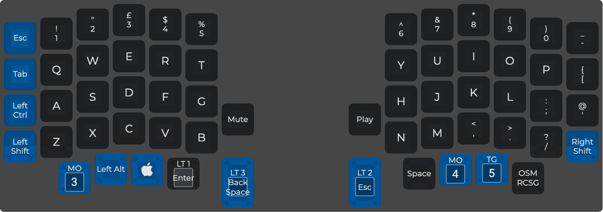
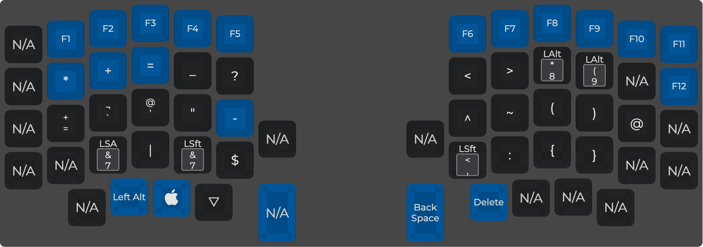
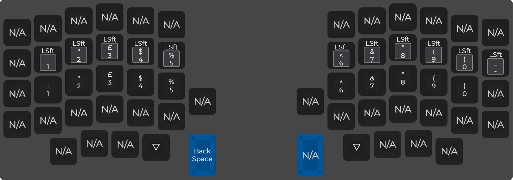
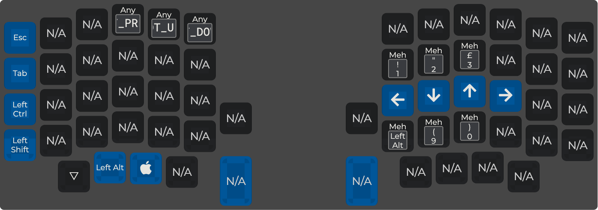
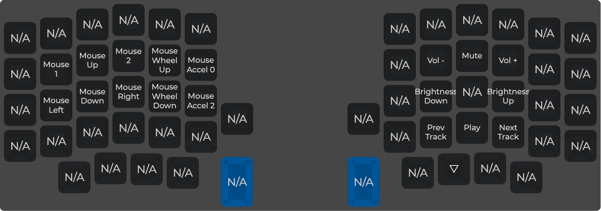
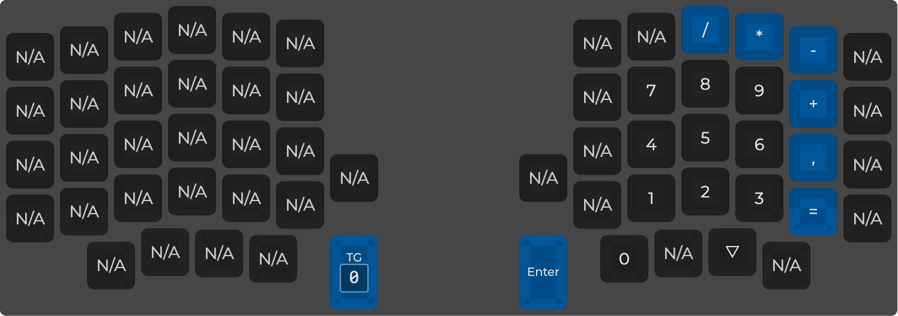

## QMK Keymaps for a sofle v1, a splitkb corne and a cantor.
The base layer is basically a Swedish ISO layout.

[Sofle v1](https://github.com/josefadamcik/SofleKeyboard) is 6×4+5
keys column-staggered split keyboard and was the first DIY keyboard
I built. The code for this keyboard is found in the [jorgen99](jorgen99) folder.

After a while I realised I never use the top number-row on my Sofle, 
as I have them on the home row on a layer. So the next keyboard I
built was the [Aurora Corne](https://docs.splitkb.com/hc/en-us/articles/6269789921564-Aurora-Build-Guide-1-Introduction)
from [splitkb.com](https://splitkb.com/).
The code for this keyboard is found in the [splitkbcorne](splitkbcorne) folder.

The code for the cantor keyboard is basically the corne minus
the oled stuff, since the cantor doesn't have any displays.
The [cantor](https://42keebs.eu/shop/kits/pro-micro-based/cantor-pro-40-low-profile-hotswap-split-ergo-kit/)
is a 3x6+3 design with a higher vertical stagger for the pinky columns.
It uses a Black Pill STM32 ARM controller that has enough I/O that there's
no need for diodes.


https://docs.qmk.fm/#/

https://config.qmk.fm/#/sofle/rev1/LAYOUT

### Mac and Windows.
The master branch contains the keymap for Mac, the 'win' branch
contains the same keymap for Windows. On Swedish ISO keybords
the difference between Mac and Windows keybord layouts are basically
curly braces, vertical bar and backslash. Also, Alt and Cmd.

I flash the Mac version to the left controller and the Windows version
to the right controller and plug the usb-cable in to the different
controller based on the os I'm currently using.

Since the controller normally is on the left keyboard you need to
put the following line into config.h to make it work in the windows
version.

```
define MASTER_RIGHT
```

### install qmk
```
brew install qmk/qmk/qmk
```

I have the 'jorgen99' folder in this repo soft linked into
my qmk dir at `keyboards/sofle/keymaps`


### setup
```
qmk setup
qmk config user.keymap=jorgen99
```

Link the keymap directories into their keyboard folders in the qmk installation.
```
ln -s <this-dir>/jorgen99 <qmk-install-dir>/keyboards/sofle/keymaps/jorgen99

and

ln -s <this-dir>/splitkbcorne <qmk-install-dir>/keyboards/splitkb/aurora/corne/keymaps/jorgen99
```

### compile

```
qmk compile -kb sofle -km jorgen99

or

qmk compile -kb splitkb/aurora/corne -km jorgen99
```

### QMK Configurator json from keymap.c
You can import the json into the QMK Configurator and play around
with it. Also print a nice diagram if you need a cheet sheet
for the keymap.
```
qmk c2json -kb sofle -km jorgen99 -o jorgens_sofle/jorgen99_sofle.json jorgens_sofle/jorgen99/keymap.c
```

## Layout
These images are a bit out of date. For a completely accurate
layout check `jorgen/keymap.c`







